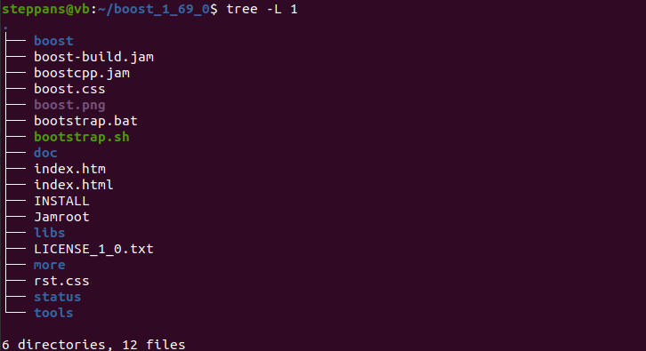
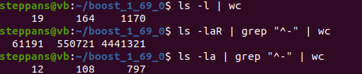
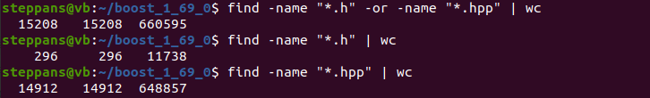
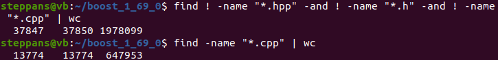
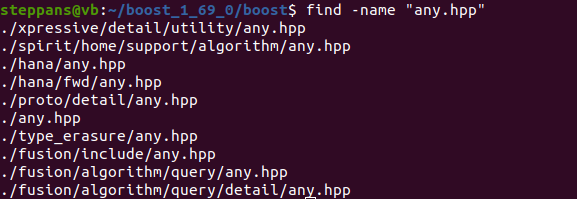
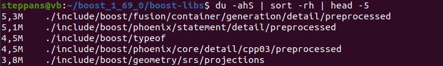
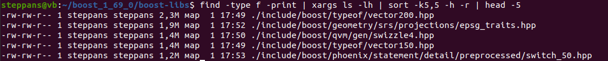

# Laboratory work 1
## Tasks
1. Firstly, I downloaded library of *boost* from `https://sourceforge.net/projects/boost/files/boost/1.69.0/boost_1_69_0.tar.gz` using **wget**.
2. Then by `tar -xvf` I unarchived file to directory `~/boost_1_69_0`.
3. Using `tree -L 1` I counted, how many files are in directory `~/boost_1_69_0`.

4. - `tree` helped me to count all diractories and files in `~/boost_1_69_0`. It show me tree of files and in the end of command I found total number.

   - We can also use command `ls` with parametres `-a`, `-l`, `-R`, and command `grep "^-"` which helps to avoid directories for tasks number **3** and **4**.

5. - To find neccessary files I used command `find` and folowing **conditions**. 

   - I could also used parametre `type -f` to find only files without directories.
6. - If we want to find all files with name **any.hpp** we need use command `find`.

   - If we want to find full path to file in only this directory we need use `realpath`. 

7. Using `grep -rl "boost::asio" ~/boost_1_69_0/boost` we output to consol all files that contain sequence **boost::asio**.
8. I used `./bootstrap.sh --prefix=boost-libs`, created `./boost-libs` in `~/boost_1_69_0`. Then I used `.b2 install` to compile *boost*.
9. To output all file and their sizes in this directory we can use `tree -h` or `ls -Rlh`.
10. - Firstly, I used `du -ahS | sort -rh | head -5`, but then I understood that `-S` do not count sizes of subdirectories but it do not ban output of  directories.

    - So, I decided to use `find -type f -print | argvs ls -lh | sort -k5,5 -rh | head -5`.
  
